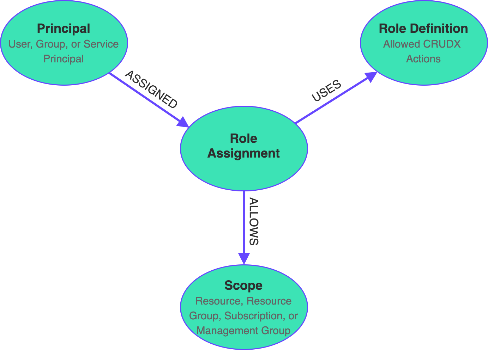
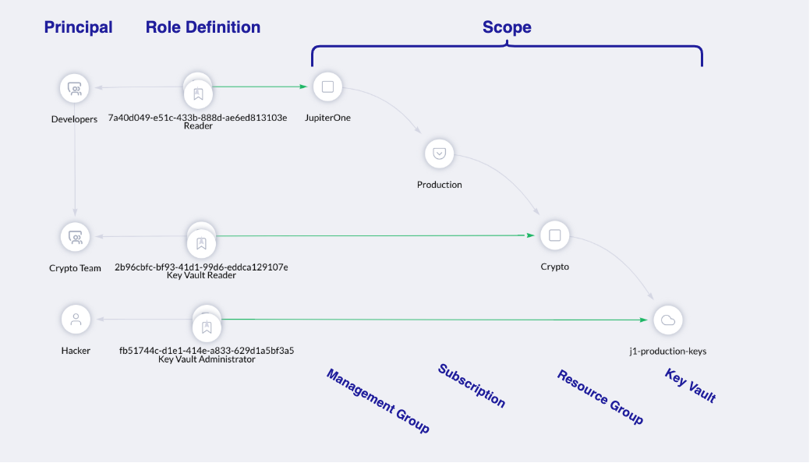

# Azure Access Review using Optional Traversals in JupiterOne

Azure role-based access control (RBAC) allows for expressive access policies
through the use of Azure role assignments. Azure role assignments are nodes that
link three distinct constructs in Azure:

1. **Principals:** Users, Groups, and Service Principals
1. **Role Definitions:** Actions allowed or disallowed
1. **Scope:** Specific resources or collections of resources that a Principal is
   allowed to access

With three arbitrary relationships to target entities, Azure role assignments
are well modeled as a graph of entities and relationships:



The role assignment's scope makes it difficult to do full access reviews at the
resource level, because access granted at the resource group, subscription, or
management group level also allows access to a given resource. Luckily, the
JupiterOne Azure integration builds relationships across all of these levels,
giving J1 users a complete view of their Azure role-based access.

In the example below, the JupiterOne graph viewer shows all of the groups and
users that have access to the key vault `j1-production-keys`, along with their
role. All developers in the `Developer` group have `Reader` access to the
`JupiterOne` management group, which also grants them `Reader` to this key
vault. However, the `Hacker` user has been assigned `Key Vault Administrator` to
this key vault, exposing this key vault to direct mutation.



Querying for RBAC access is acheived through J1QL's unique
[optional traversals](https://support.jupiterone.io/hc/en-us/articles/360022722014-J1QL-Language-Specs#optionaltraversalsbeta)
(syntax: `(THAT HAS *)?`). The syntax allows users to identify any `ALLOWS`
relationships between an `azure_role_assignment` and a target resource by way of
management groups, subscriptions, or resource groups.

**Which users, groups, or service principals are assigned a role that allows
access to the `j1-production-keys` key vault?**

```J1QL
FIND azure_keyvault_service 
  WITH name = 'j1-production-keys'
    (THAT HAS azure_resource_group)? 
    (THAT HAS azure_subscription)? 
    (THAT HAS azure_management_group)? 
    THAT ALLOWS azure_role_assignment 
    THAT ASSIGNED 
      (azure_user|azure_user_group|azure_service_principal) as principal
RETURN TREE
```

Using this query structure, JupiterOne users can expressively interrogate their
Azure environments for vulnerable access controls. See the following sample
queries to help you get started.

---

**Can any users or groups read the value of a secret in any key vault?**

_Users should never have access to secrets in production accounts._

```J1QL
FIND azure_keyvault_service 
  (THAT HAS azure_resource_group)? 
  (THAT HAS azure_subscription)? 
  (THAT HAS azure_management_group)? 
  THAT ALLOWS azure_role_assignment 
    WITH dataActions = 'Microsoft.KeyVault/vaults/secrets/getSecret/action'
  THAT ASSIGNED (azure_user|azure_user_group) as principal
RETURN TREE
```

**Are there any users that are granted direct access to resources (not via
groups)?**

_User access should always be granted via membership in groups. Direct access is
often a proxy for elevated privileges, and should be discouraged._

```J1QL
FIND * as any_resource 
  (THAT HAS azure_resource_group)? 
  (THAT HAS azure_subscription)? 
  (THAT HAS azure_management_group)?
  THAT ALLOWS azure_role_assignment 
  THAT ASSIGNED azure_user
RETURN TREE
```

**Do any guest users have access to the `j1-production-keys` key vault?**

_Guest users should have no access to the production key vault. Use an optional
traversal to enumerate users with **direct** access as well as users who have
access as part of a group._

```J1QL
FIND azure_keyvault_service WITH name = 'j1-production-keys'
  (THAT HAS azure_resource_group)? 
  (THAT HAS azure_subscription)? 
  (THAT HAS azure_management_group)? 
  THAT ALLOWS azure_role_assignment 
  THAT ASSIGNED (azure_user|azure_group) WITH userType = 'Guest'
  (THAT HAS azure_user WITH userType = 'Guest')?
RETURN TREE
```
